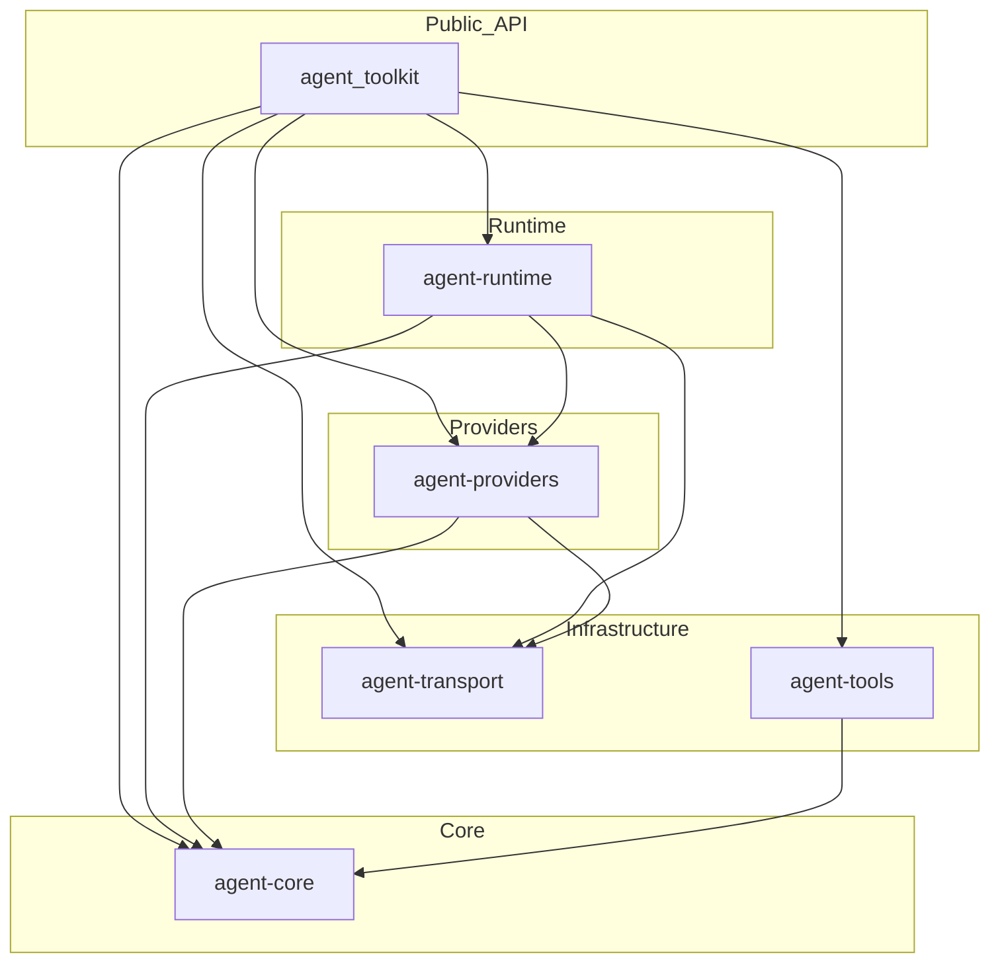

# agent_toolkit (WIP)

[](https://deepwiki.com/squee72564/agent-toolkit)

Minimal Rust workspace for providing basic agent building primitives.

This is an educational repository and is not intended to be used for production code.

## Examples

Runnable examples live in `crates/agent/examples`.

Load credentials from `.env` or your shell environment, then run:

```bash
cargo run -p agent_toolkit --example basic_openai
```



## Workspace Layout
- `agent` (`agent_toolkit`): facade crate with public re-exports for core, runtime, providers, transport, and tools.
- `agent-core`: provider-agnostic domain types and traits shared across crates, including canonical `ProviderId`.
- `agent-providers`: provider-specific encode/decode/spec logic
- `agent-runtime`: high-level clients (`openai()`, `anthropic()`, `openrouter()`), toolkit routing/fallback orchestration, and unified adapter-driven execution flow.
- `agent-transport`: HTTP transport implementation, auth/header handling, generic request bodies, and JSON/SSE/bytes response helpers.
- `agent-tools`: lightweight tool trait and registry primitives for tool integration.

## TODO 
- built-in tool-execution loop (agent-runner) over Response::ToolCalls.
- preserve and expose reasoning/thinking content instead of dropping it.
- multimodal input support (images/files in message content)

## Release-readiness quality gates

This workspace uses deterministic release-readiness gates in CI:


1. `cargo check --workspace --all-targets --locked`
2. `cargo fmt --all`
3. `cargo clippy --workspace --all-targets --all-features -- -D warnings`
4. `cargo clippy --workspace --lib --all-features -- -D clippy::unwrap_used -D clippy::expect_used -D clippy::panic`
5. `cargo test --workspace --all-targets --all-features -- --quiet`
6. `RUSTDOCFLAGS='-D warnings' cargo doc --workspace --all-features --no-deps --document-private-items`

`clippy::unwrap_used`, `clippy::expect_used`, and `clippy::panic` are intentionally enforced on non-test targets only.

## Deterministic vs live tests

The default CI quality path is deterministic and does not make outbound provider calls.

Live provider tests are opt-in and only run when explicitly requested in workflow dispatch or when `RUN_LIVE_TESTS=true` is configured in repository variables. The live test contract requires:

- `OPENAI_API_KEY`
- `ANTHROPIC_API_KEY`
- `OPENROUTER_API_KEY`

If credentials are missing, the `live_tests` job exits with a clear deterministic skip message.

## Toolchain and compatibility policy

- Toolchain source of truth: `rust-toolchain.toml` (`1.93.0`, with `rustfmt` + `clippy`).
- Workspace compatibility floor: `rust-version = "1.88"`.
- Workspace lint policy is centralized in root `Cargo.toml` and inherited in all crates via `[lints] workspace = true`.

## Publish-readiness metadata

Workspace crate metadata is normalized for release readiness (license, repository/homepage/documentation, readme, keywords, categories, descriptions).

Maintainers can validate publish readiness per crate using:

```bash
cargo publish --dry-run -p <crate-name>
```
