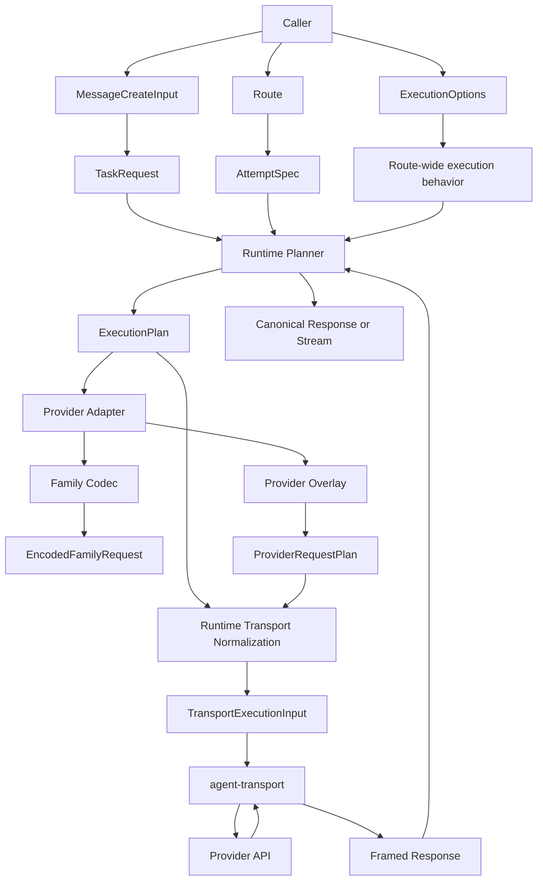
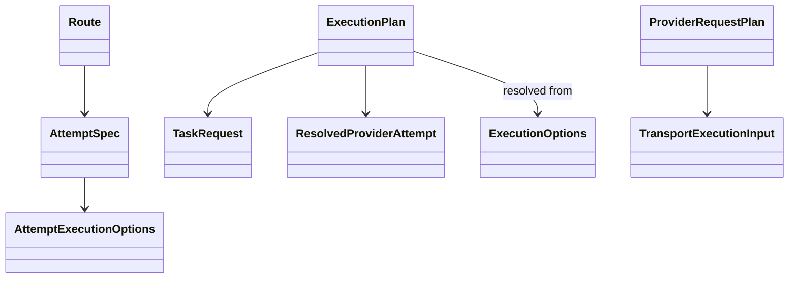
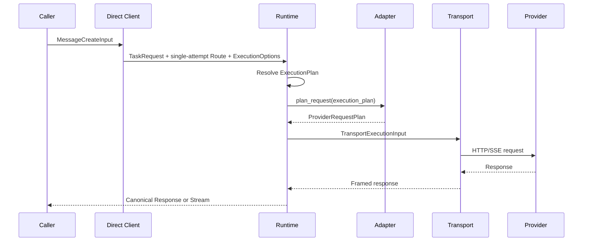
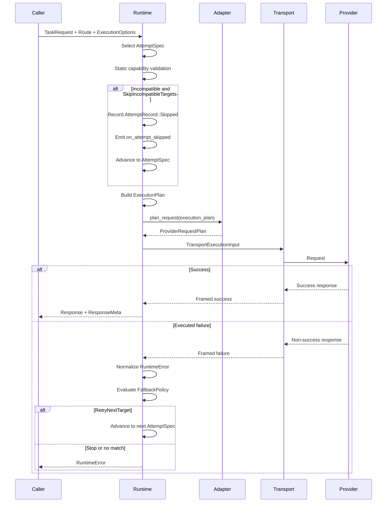
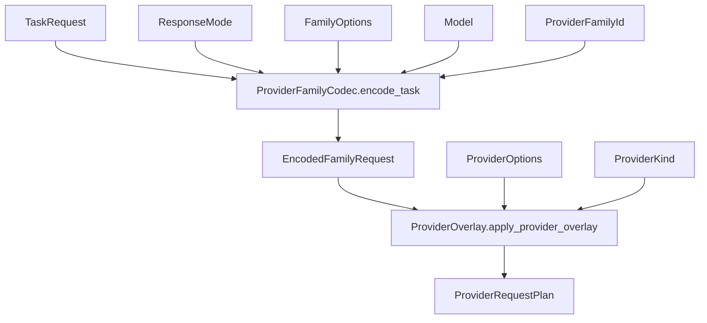
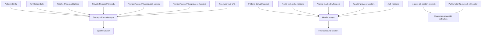
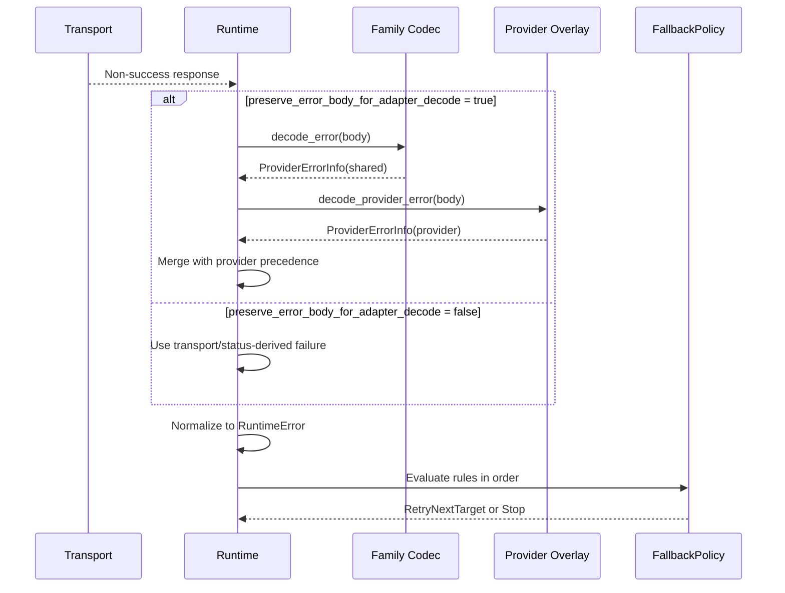
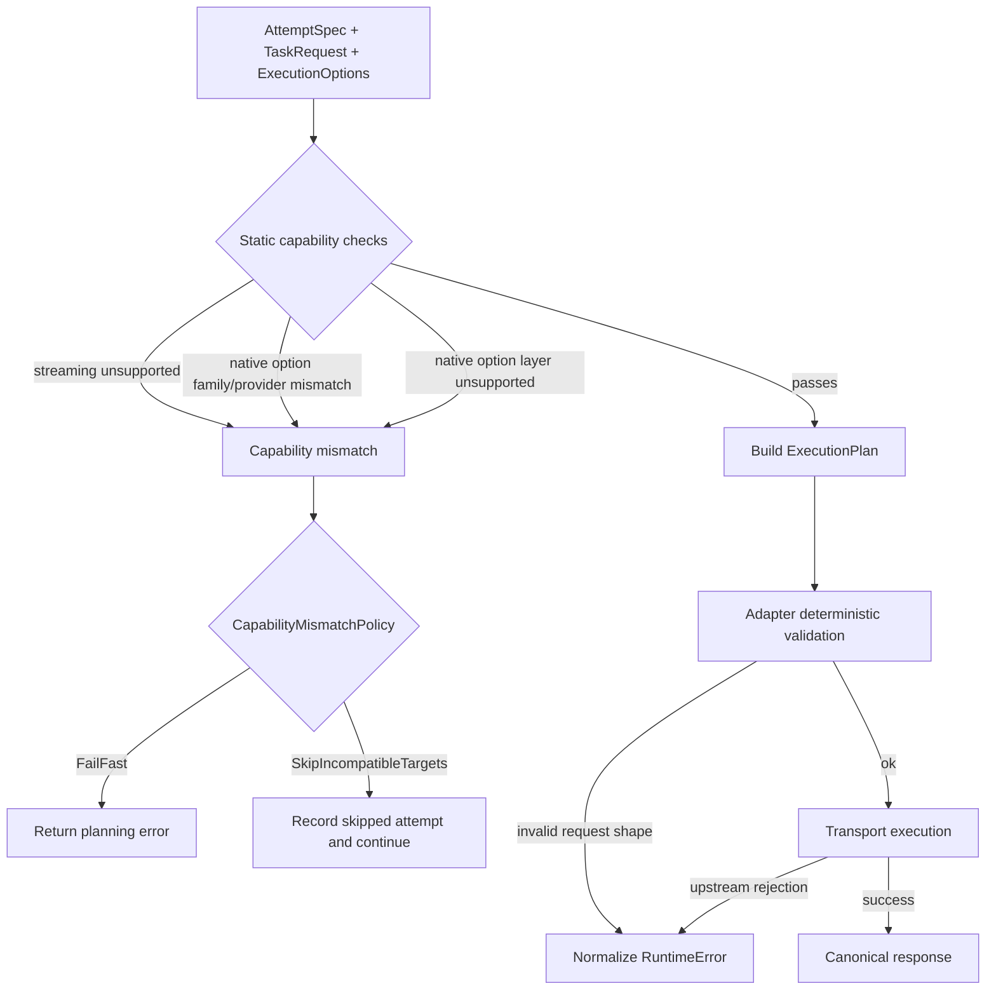

# SPEC Walkthrough: REFACTOR2 Multi-Provider Runtime Architecture

This document turns `REFACTOR2.md` into a consumer-and-implementer walkthrough.
It focuses on three things:

- what the new public API shape feels like
- how data moves through the runtime
- where each subsystem owns behavior, validation, and decisions

The target architecture replaces the old "request + send options" mental model with three first-class inputs:

- `TaskRequest`: what the model should do
- `Route`: where it may run
- `ExecutionOptions`: how the call should execute

Everything else in the spec exists to preserve that split across planning, provider mapping, transport execution, and fallback.

## 1. Core Mental Model

### The old problem

The current design mixes together:

- semantic task content
- provider/model selection
- streaming mode
- fallback behavior
- transport metadata
- provider-specific native knobs

That makes routed multi-provider execution awkward, especially when each fallback attempt needs different native options, different timeouts, or different provider overlays.

### The new split

The new design separates the call into three orthogonal inputs:

```rust
pub struct TaskRequest {
    pub messages: Vec<Message>,
    pub tools: Vec<ToolDefinition>,
    pub tool_choice: ToolChoice,
    pub response_format: ResponseFormat,
    pub temperature: Option<f32>,
    pub top_p: Option<f32>,
    pub max_output_tokens: Option<u32>,
    pub stop: Vec<String>,
    pub metadata: BTreeMap<String, String>,
}

pub struct Route {
    pub primary: AttemptSpec,
    pub fallbacks: Vec<AttemptSpec>,
    pub fallback_policy: FallbackPolicy,
    pub capability_mismatch_policy: CapabilityMismatchPolicy,
}

pub struct ExecutionOptions {
    pub response_mode: ResponseMode,
    pub observer: Option<Arc<dyn RuntimeObserver>>,
    pub transport: TransportOptions,
}
```

The key consequences are:

- `TaskRequest` no longer owns model, stream, fallback, transport, or native provider controls.
- `Route` no longer owns semantic task content or observer/transport-wide execution behavior.
- `ExecutionOptions` no longer owns routing topology or provider-native request controls.

## 2. Identity Model

The spec deliberately splits provider identity into three layers:

```rust
pub enum ProviderFamilyId {
    OpenAiCompatible,
    Anthropic,
}

pub enum ProviderKind {
    OpenAi,
    OpenRouter,
    Anthropic,
    GenericOpenAiCompatible,
}

pub struct ProviderInstanceId(String);
```

Use them like this:

- `ProviderFamilyId`: shared wire behavior and shared family-native controls
- `ProviderKind`: concrete adapter and overlay behavior
- `ProviderInstanceId`: one registered runtime destination with its own auth, base URL, retry policy, and timeout defaults

That means two self-hosted OpenAI-compatible backends can share:

- family codec: `OpenAiCompatible`
- provider kind: `GenericOpenAiCompatible`

while still being different runtime targets because they have different `ProviderInstanceId`s.

## 3. High-Level API Examples

### 3.1 Direct client, default non-streaming

```rust
let input = MessageCreateInput::user("Write one sentence about Rust.");

let response = openai_client
    .messages()
    .create(input)
    .await?;
```

Conceptually this normalizes into:

- `TaskRequest` from `MessageCreateInput`
- a single-attempt `Route`
- inferred `ExecutionOptions { response_mode: NonStreaming, observer: None, transport: default }`

### 3.2 Direct client with model override

```rust
let response = openai_client
    .messages()
    .model("gpt-5")
    .create(MessageCreateInput::user("Summarize Rust ownership in one paragraph."))
    .await?;
```

Important detail:

- `.model("gpt-5")` does not mutate `TaskRequest`
- it becomes `AttemptSpec.target.model` on the generated single-attempt route

### 3.3 Direct client with layered native options

```rust
let response = openrouter_client
    .messages()
    .create_with_options(
        MessageCreateInput::user("Use tools if useful."),
        NativeOptions {
            family: Some(FamilyOptions::OpenAiCompatible(
                OpenAiCompatibleOptions {
                    parallel_tool_calls: Some(true),
                    ..Default::default()
                }
            )),
            provider: Some(ProviderOptions::OpenRouter(
                OpenRouterOptions::new().with_route("fallback")
            )),
        },
    )
    .await?;
```

This expresses the intended layering:

- OpenAI-family shared controls go in `family`
- OpenRouter-only controls go in `provider`

### 3.4 Routed toolkit, default execution behavior

```rust
let route = Route::to(
    AttemptSpec::to(
        Target::new(ProviderInstanceId::new("openai-default"))
            .with_model("gpt-5")
    )
)
.with_fallback(
    AttemptSpec::to(
        Target::new(ProviderInstanceId::new("openrouter-default"))
            .with_model("openai/gpt-5")
    )
)
.with_policy(FallbackPolicy::default());

let response = toolkit
    .messages()
    .create(
        MessageCreateInput::user("Write one short sentence about Rust."),
        route,
    )
    .await?;
```

The ergonomic routed methods infer:

```rust
ExecutionOptions {
    response_mode: ResponseMode::NonStreaming,
    observer: None,
    transport: TransportOptions::default(),
}
```

### 3.5 Routed toolkit with explicit execution options

```rust
let route = Route::to(
    AttemptSpec::to(
        Target::new(ProviderInstanceId::new("openai-default"))
            .with_model("gpt-5")
    )
)
.with_fallback(
    AttemptSpec::to(
        Target::new(ProviderInstanceId::new("openrouter-default"))
            .with_model("openai/gpt-5")
    )
    .with_native_options(NativeOptions {
        family: Some(FamilyOptions::OpenAiCompatible(
            OpenAiCompatibleOptions {
                parallel_tool_calls: Some(true),
                ..Default::default()
            }
        )),
        provider: Some(ProviderOptions::OpenRouter(
            OpenRouterOptions::new().with_route("fallback")
        )),
    })
    .with_timeout_overrides(TransportTimeoutOverrides {
        request_timeout: Some(Duration::from_secs(20)),
        stream_setup_timeout: None,
        stream_idle_timeout: None,
    })
    .with_extra_header("x-attempt", "fallback-1")
);

let execution = ExecutionOptions {
    response_mode: ResponseMode::NonStreaming,
    observer: None,
    transport: TransportOptions {
        request_id_header_override: Some("x-request-id".into()),
        extra_headers: BTreeMap::from([("x-trace-id".into(), "abc123".into())]),
    },
};

let (response, meta) = toolkit
    .messages()
    .create_with_meta_and_execution(
        MessageCreateInput::user("Write one short sentence about Rust."),
        route,
        execution,
    )
    .await?;
```

This is the clean split in one example:

- task semantics live in `MessageCreateInput` / `TaskRequest`
- target chain lives in `Route`
- route-wide execution behavior lives in `ExecutionOptions`
- target-local native options, headers, and timeout overrides live in `AttemptExecutionOptions`

### 3.6 Low-level explicit API

```rust
let task = TaskRequest {
    messages: vec![Message::user("Return JSON only.")],
    tools: vec![],
    tool_choice: ToolChoice::None,
    response_format: ResponseFormat::Json,
    temperature: None,
    top_p: None,
    max_output_tokens: Some(200),
    stop: vec![],
    metadata: BTreeMap::new(),
};

let response = client
    .messages()
    .create_task_with_attempt(
        task,
        AttemptExecutionOptions {
            native: Some(NativeOptions {
                family: Some(FamilyOptions::OpenAiCompatible(
                    OpenAiCompatibleOptions {
                        reasoning: Some(OpenAiReasoning::default()),
                        ..Default::default()
                    }
                )),
                provider: Some(ProviderOptions::OpenAi(
                    OpenAiOptions {
                        service_tier: Some("priority".into()),
                        ..Default::default()
                    }
                )),
            }),
            timeout_overrides: TransportTimeoutOverrides::default(),
            extra_headers: BTreeMap::new(),
        },
        ExecutionOptions {
            response_mode: ResponseMode::NonStreaming,
            observer: None,
            transport: TransportOptions::default(),
        },
    )
    .await?;
```

This is the replacement for the old monolithic low-level request API.

## 4. Native Options: Family vs Provider Layer

The spec makes native controls explicit and attempt-local:

```rust
pub enum FamilyOptions {
    OpenAiCompatible(OpenAiCompatibleOptions),
    Anthropic(AnthropicFamilyOptions),
}

pub enum ProviderOptions {
    OpenAi(OpenAiOptions),
    Anthropic(AnthropicOptions),
    OpenRouter(OpenRouterOptions),
}

pub struct NativeOptions {
    pub family: Option<FamilyOptions>,
    pub provider: Option<ProviderOptions>,
}
```

Rules:

- family options are shared protocol-family knobs
- provider options are concrete-provider knobs
- both are target-scoped and attempt-local
- mismatched native options are static incompatibilities, not ignored inputs

Examples:

Family-only:

```rust
NativeOptions {
    family: Some(FamilyOptions::OpenAiCompatible(
        OpenAiCompatibleOptions {
            parallel_tool_calls: Some(true),
            ..Default::default()
        }
    )),
    provider: None,
}
```

Family + provider:

```rust
NativeOptions {
    family: Some(FamilyOptions::OpenAiCompatible(
        OpenAiCompatibleOptions {
            reasoning: Some(OpenAiReasoning::default()),
            ..Default::default()
        }
    )),
    provider: Some(ProviderOptions::OpenAi(
        OpenAiOptions {
            service_tier: Some("priority".into()),
            ..Default::default()
        }
    )),
}
```

The design intent is:

- family codecs validate and encode family options
- provider overlays validate and encode provider options

## 5. Runtime vs Adapter vs Transport

This is the most important ownership boundary in the spec.

### Runtime owns

- converting `MessageCreateInput` into `TaskRequest`
- constructing or iterating `Route`
- selecting the attempt
- resolving `ProviderInstanceId` into `RegisteredProvider`
- selecting the adapter by `ProviderKind`
- resolving `ProviderFamilyId`
- resolving `PlatformConfig` from `ProviderDescriptor + ProviderConfig`
- resolving transport defaults and attempt-local overrides into `ResolvedTransportOptions`
- validating static capability mismatches
- applying `CapabilityMismatchPolicy`
- building `ExecutionPlan`
- building the final typed transport input
- normalizing failures into `RuntimeError`
- evaluating fallback after executed failures

### Provider adapter owns

- converting `ExecutionPlan` into `ProviderRequestPlan`
- using family codecs for shared family request mapping
- using provider overlays for concrete-provider augmentation
- consuming family and provider native options in the correct layer
- emitting protocol-specific `HttpRequestOptions`
- emitting provider-generated dynamic headers
- selecting non-default endpoint path only via `endpoint_path_override`
- decoding successful provider responses
- exposing family/provider error decode hooks
- exposing or overriding streaming projection

### Transport owns

- final HTTP/SSE execution
- final header materialization
- auth header placement
- retry within an attempt
- request/stream timeout enforcement
- response framing
- request-id extraction from the selected response header

Transport does not:

- evaluate fallback
- decode provider-specific error bodies
- decide capability mismatch
- invent endpoint paths

## 6. Family Codec vs Provider Overlay

The provider layer is intentionally split in two.

### Family codec

The family codec handles shared wire behavior for a protocol family.

```rust
pub trait ProviderFamilyCodec {
    fn encode_task(
        &self,
        task: &TaskRequest,
        model: &str,
        response_mode: ResponseMode,
        family_options: Option<&FamilyOptions>,
    ) -> Result<EncodedFamilyRequest, AdapterError>;

    fn decode_response(
        &self,
        body: Value,
        format: &ResponseFormat,
    ) -> Result<Response, AdapterError>;

    fn decode_error(&self, body: &Value) -> Option<ProviderErrorInfo>;
}
```

It owns:

- shared task-to-wire mapping
- family-scoped native option encoding
- family-default request hints
- family response decode
- family error decode

### Provider overlay

The provider overlay handles provider-specific quirks on top of the family contract.

```rust
pub trait ProviderOverlay {
    fn apply_provider_overlay(
        &self,
        request: &mut EncodedFamilyRequest,
        provider_options: Option<&ProviderOptions>,
    ) -> Result<(), AdapterError>;

    fn decode_provider_error(&self, body: &Value) -> Option<ProviderErrorInfo>;
}
```

It owns:

- provider-specific request augmentation
- provider-scoped native option encoding and validation
- provider-generated dynamic headers
- provider-specific endpoint override
- provider-specific response/error quirks

The composition model is:

- OpenAI = OpenAI-compatible codec + OpenAI overlay
- OpenRouter = OpenAI-compatible codec + OpenRouter overlay
- Anthropic = Anthropic codec + Anthropic overlay
- GenericOpenAiCompatible = OpenAI-compatible codec + generic overlay

## 7. Runtime-to-Transport Boundary

The spec locks in a typed runtime-to-transport boundary:

```rust
pub struct TransportExecutionInput {
    pub platform: PlatformConfig,
    pub auth_token: Option<AuthCredentials>,
    pub method: Method,
    pub url: String,
    pub body: HttpRequestBody,
    pub response_mode: HttpResponseMode,
    pub request_options: HttpRequestOptions,
    pub transport: ResolvedTransportOptions,
    pub provider_headers: HeaderMap,
}
```

This means:

- no metadata-driven transport control
- no `AdapterContext.metadata` in the target architecture
- no stringly-typed request-id override channel

### Typed request construction flow

1. runtime resolves `PlatformConfig`
2. runtime resolves `ResolvedTransportOptions`
3. adapter emits `ProviderRequestPlan`
4. runtime resolves endpoint path:
   - `ProviderRequestPlan.endpoint_path_override`, else
   - `ProviderDescriptor.endpoint_path`
5. runtime joins path with `PlatformConfig.base_url`
6. runtime builds `TransportExecutionInput`
7. transport materializes headers and executes the request

### Header layering

Header precedence is fixed:

1. platform default headers
2. route-wide extra headers
3. attempt-local extra headers
4. adapter/provider-generated dynamic headers
5. auth headers

Later layers override earlier ones except auth placement, which remains transport-owned.

### Request-id extraction semantics

`request_id_header_override` affects only response metadata extraction.

It does not:

- emit an outbound request header
- rename a header in the outbound request
- participate in header merge order

If the caller wants to send an outbound header with the same name, they must add it through normal extra headers.

## 8. Execution Flow

### 8.1 Direct client flow

1. user creates `MessageCreateInput`
2. direct client normalizes it to `TaskRequest`
3. direct client creates a single `AttemptSpec`
4. direct client wraps that in a single-attempt `Route`
5. direct client infers `ExecutionOptions`
6. runtime resolves the attempt into `ExecutionPlan`
7. adapter creates `ProviderRequestPlan`
8. runtime builds `TransportExecutionInput`
9. transport executes
10. runtime decodes success into canonical response or stream

### 8.2 Routed toolkit flow

1. user creates `MessageCreateInput`
2. user creates `Route`
3. toolkit converts input into `TaskRequest`
4. toolkit resolves or infers `ExecutionOptions`
5. runtime iterates route attempts in order
6. for each attempt:
   - resolve `ProviderInstanceId` to `RegisteredProvider`
   - resolve `ProviderKind`
   - resolve `ProviderFamilyId`
   - resolve model
   - resolve `PlatformConfig`
   - resolve transport options
   - validate static mismatches
   - if compatible, build `ExecutionPlan`
   - adapter produces `ProviderRequestPlan`
   - runtime builds `TransportExecutionInput`
   - transport executes
7. on success, runtime returns response plus attempt history
8. on executed failure, runtime normalizes the error and evaluates fallback

## 9. Static Capability Mismatch vs Real-Time Validation

The spec is intentionally conservative about what is checked statically.

### Static capability mismatch

This is only for high-confidence checks before any provider call is made:

- streaming requested but provider does not support streaming
- family native options do not match the target family
- provider native options do not match the target provider kind
- provider does not support family-native options at all
- provider does not support provider-native options at all

This is governed by:

```rust
pub enum CapabilityMismatchPolicy {
    FailFast,
    SkipIncompatibleTargets,
}
```

Behavior:

- `FailFast`: planning fails immediately
- `SkipIncompatibleTargets`: attempt is recorded as skipped and routing advances

### Real-time validation

These are not treated as static capability checks:

- tools
- structured output
- `top_p`
- stop sequences
- reasoning controls
- model/deployment-specific feature support

Those are handled by:

- deterministic adapter validation where possible
- upstream provider rejection where necessary
- normalization into `RuntimeError`

So the architecture prefers:

- narrow static validation
- strong runtime normalization

instead of broad but unreliable provider capability claims.

## 10. Fallback Behavior

Fallback is now only about executed failures.

```rust
pub struct FallbackPolicy {
    pub rules: Vec<FallbackRule>,
}
```

Important consequences:

- fallback targets live on `Route`, not on `FallbackPolicy`
- fallback is rule-driven
- fallback never evaluates raw HTTP bodies
- fallback never runs on skipped static mismatches

### Matching semantics

The first matching rule wins.

`FallbackMatch` uses AND semantics:

- every non-empty field must match
- empty fields are ignored
- no match means no fallback

It can match on:

- normalized runtime error kind
- normalized status code
- normalized provider code
- `ProviderKind`
- `ProviderInstanceId`

### Attempt history semantics

Skipped attempts are first-class:

- recorded in `ResponseMeta.attempts`
- exposed through `AttemptRecord`
- reported via `on_attempt_skipped`
- not treated as failed executions

## 11. Error Decoding and Normalization

This path is one of the most important spec clarifications.

### Non-success response path

1. transport returns a non-success framed response
2. if adapter requested `preserve_error_body_for_adapter_decode`, runtime keeps the body
3. runtime invokes family codec error decode
4. runtime invokes provider overlay error decode
5. runtime merges both results, with provider overlay taking precedence
6. runtime normalizes the merged result into `RuntimeError`
7. fallback evaluates the normalized error

If the adapter did not request error-body preservation:

- the failure remains transport/status-derived
- fallback evaluates that normalized transport error instead

### Why this split matters

It prevents these responsibilities from blurring:

- adapter decode: extract provider-shaped error meaning
- runtime normalization: create the stable public error surface
- fallback evaluation: decide whether to continue routing

## 12. System Diagrams

### 12.1 Architecture ownership



### 12.2 Core type relationships



### 12.3 Direct client sequence



### 12.4 Routed fallback sequence



### 12.5 Codec and overlay composition



### 12.6 Transport boundary



### 12.7 Error normalization and fallback



### 12.8 Static vs real-time validation



## 13. Practical Reading Guide

If you are consuming the API, the main thing to internalize is:

- build task semantics once
- build route attempts explicitly
- keep route-wide execution behavior on `ExecutionOptions`
- keep target-specific native knobs and timeout/header overrides on `AttemptSpec.execution`

If you are implementing the runtime, the main invariant is:

- runtime resolves ambiguity before adapter planning
- adapter plans provider-specific request intent but not transport ownership
- transport executes typed intent but does not interpret provider semantics

That is the entire architecture in one sentence:

`TaskRequest + Route + ExecutionOptions -> ExecutionPlan -> ProviderRequestPlan -> TransportExecutionInput -> canonical response or normalized error`.
